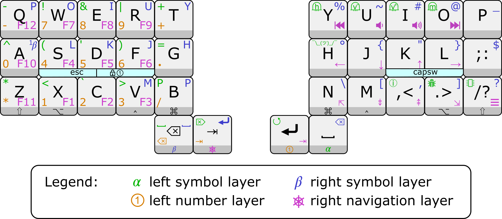

# ButteredBread's Keyboard Layout

This is my 34-key keyboard layout.

## Goals
  - fast, efficient, and natural (at least to me) typing for programming
  - make common key combinations and layer activations bilateral
  - easy left hand only operation for numbers, common shortcuts
  - able to operate CAD programs and such without removing right hand from mouse
  - qwerty, but someone could easily modify it for other alpha layouts

## Principles and Features
  - base layer for alphas
  - thumb clusters are mod-tap keys that activate four additional layers
  - mod-tap for modifiers (shift, gui, control, alt), but not on home row
  - caps word
  - number pad lock
  - navigation keys
  - basic multimedia keys
  - keys for adjusting keyboard LEDs, navigating keyboard LCD, etc.

## Overview

  - base layer:
    - alphas
    - three combos: escape, number lock, and caps word
  - left symbol layer:
    - symbols on left hand, keyboard functions on right hand
    - activated by holding outer right thumb key (space)
  - right symbol layer:
    - symbols on right hand, right alphas mirrored to left hand
    - activated by holding outer left thumb key (backspace)
    - can be one-shotted for left-handed typing (primarily for cad use)
  - left number layer:
    - numbers on left hand, currently nothing on right hand
    - activated by holding inner right thumb key (enter)
    - can be locked for typing in numbers
  - right navigation layer:
    - navigation and multimedia on right hand, function keys on left hand
    - activated by holding inner left thumb key (tab)
  - modifiers:
    - on bottom row instead of the more common home row

## Base Layer, including Thumb Keys, Modifiers, and Combos

I stuck with qwerty because I'm a touch typer, that's what I knew, and I wanted to benefit from my existing muscle memory. It should be pretty easy to adapt to other layouts.

When tapped, the thumb keys are (in order from left to right): backspace, tab, return, and space. Having backspace on the left hand is nice for CAD and drawing programs (it usually deletes the selected object).

A disadvantage to using mod-tap is that you can't hold a key to repeat it. This is a nuisance with thumb keys, particularly space and backspace. As a workaround, the layers are designed so you can hold one of the thumb keys and then hold its mirror on the other side of the keyboard to get the repeat function.

I tried home row mods, but I'm a fast and sloppy typer, so I could never get them tuned well enough. I found that moving them to the bottom row helped a lot. The home row is often where the fastest and sloppiest typing happens, and the bottom row tends to be less used and slower. I was able to tune bottom row mods so that I don't get any incorrect activations, and my typing speed with shift isn't compromised.

Speaking of shift, I put it on the bottom pinky keys on both hands. That's closest to where it is on a normal keyboard, which maybe helps me retain that muscle memory.

I'm a vim user, so I need a good place for escape. The SD combo felt good for that.

I'm a programmer, so I use caps word a lot. The KL combo felt good for that.

When typing numbers, it is convenient to turn the left hand into a number pad, including calculator symbols and enter. The DF combo felt good for that.

## Left and Right Symbol Layers

I designed these layers based on ideas that made the symbol positions easy to remember, as well as what just felt natural. Some of the concepts are:

- All paired brackets are on the same row and on the index and ring finger of each hand. This makes it conceptually easy to remember as well as fast to type when programming.
- All the various quote/string characters are on the middle fingers between the brackets.
- The `^` and `$` characters are at the beginning and end of the home row, respectively. This matches their use in regular expressions and in vim movement.
- All the calculator symbols (`+`, `-`, `*`, `/`, `=`) are on the left hand and duplicated on the number layer. This makes it possible to operate a calculator or type in spreadsheet formulae with just the left hand.
- Comma and question mark are duplicated at the same position they have in the alpha layer.
- I added a degree symbol, mostly used when typing oven temperatures for recipes.
- The remaining symbols went wherever they felt natural.

All symbols are bilateral, meaning you hold down the layer key with the thumb of one hand and press the symbol with the fingers of the other hand.

Special functions are assigned to the unilateral combinations of these layers.

In the left symbol layer, the right hand keys activate keyboard functions:
  - `y`, `u`, `i`, and `o`: cycle the LED hue, decrease the LED value, increase the LED value, and cycle the LED mode; respectively
  - `h`: outputs the shrug symbols, `\_(ツ)_/¯`
  - `,`: prints custom debugging info in QMK console
  - `.`: enables QMK debug mode
  - `/`: clears the EEPROM

In the right symbol layer, the left hand keys are a mirror of the right hand alphas. This is used for activating keyboard shortcuts while keeping the right hand on the mouse. Since using the mirrored alphas is a unilateral combination, some of the hand positions are awkward. To make it easier, the `a` key will one-shot the right symbol layer. I find it easier to type `backpspace-a, t` than `backspace-t`, for example.

## Left Number Layer

The left number layer contains all the numbers, arranged in numpad-style, as well as the dot (`.`) and calculator symbols (`+`, `-`, `*`, `/`, `=`). This allows for typing numbers and formulae with the left hand. The left thumb keys retain their functions on this layer (backspace and tab). However, space and enter can be accessed on the left thumb keys by one-shotting the right symbol layer (still with the left hand). Yes, it is slightly cumbersome, but I don't need to use them that way often, and when I do, it is still easier than moving my hand from the mouse to the keyboard and back to the mouse. Note that the 0 is in the same position as `^` -- the beginning of the home row. This is nice because both are vim movement commands that take you to the beginning of the line or to the first character in the line.

There are currently no functions for the right hand keys on the left number layer.

## Right Navigation Layer

The right navigation layer contains the arrow keys in the `hjkl` arrangement. It also has the multimedia previous, volume down, volume up, and next keys in the same arrangement on the top row. It also has home, page down, page up, and end in the same arrangement on the bottom row. The `hjkl` mapping of left, down, up, right worked out well for mapping all these keys in easy-to-remember locations.

I stuck the menu key on the bottom right, but I don't think I ever use it. There are a couple of unassigned keys that could be used for something else in the future.

The left hand keys in this layer are assigned to the function keys using the same numpad-style layout of the number layer. I don't use function keys often, so having them be unilateral combinations is fine.

## References

- [Programming on 34 Keys](https://peppe.rs/posts/programming_on_34_keys)
- [rafaelromao's Keyboard Layout](https://github.com/rafaelromao/keyboards)
- [Miryoku Layout](https://github.com/manna-harbour/miryoku)
